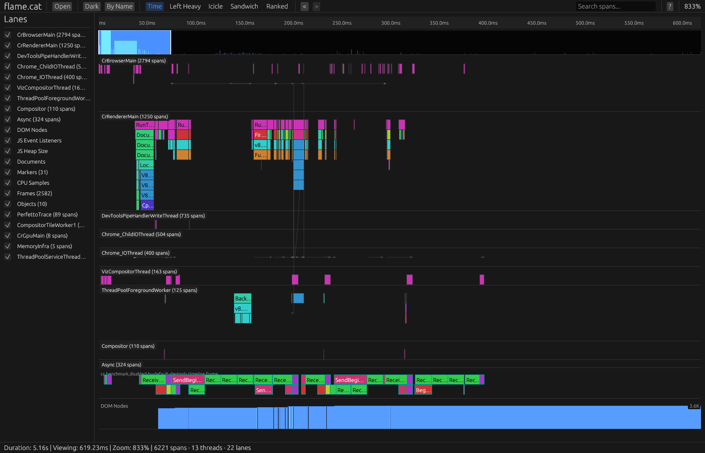
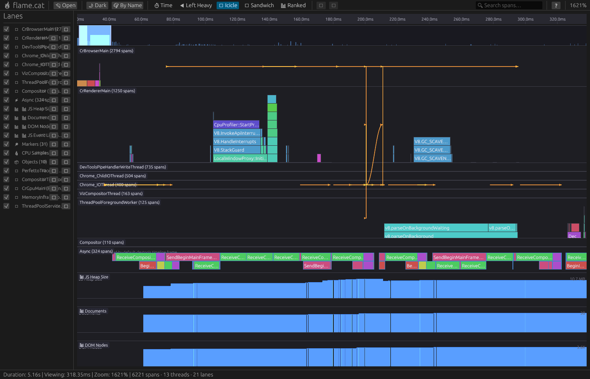

# 🔥 flame.cat

High-performance flame graph visualization tool. Renders with egui (WebGL2/native) and uses Rust for all data processing.

[](https://github.com/doom-fish/flame.cat/actions/workflows/ci.yml)



## Features

- **10 profile formats**: Chrome DevTools, Firefox Gecko, React DevTools, Speedscope, V8 CPU Profile, pprof, PIX, Tracy, eBPF/perf, Collapsed Stacks
- **5 visualization modes**: Time Order, Left Heavy, Icicle (inverted), Sandwich, Ranked
- **Color-by-package**: Consistent hue per module/package for instant readability (toggle to depth-based)
- **Multi-lane visualization**: Thread flame charts, counter tracks, marker tracks, async spans, CPU samples, frame timing, object lifecycles
- **Interactive minimap**: Density heatmap with draggable viewport handles
- **Drag-to-zoom**: Alt+drag to select a time range
- **Zoom history**: Back/forward navigation through zoom levels
- **Ancestor breadcrumbs**: Detail panel shows full parent chain
- **Search**: Filter spans by name with real-time dimming
- **Span navigation**: Parent/child/sibling traversal with keyboard
- **Export**: Save profiles as JSON or render as SVG
- **Keyboard-driven**: WASD pan, +/- zoom, Ctrl+scroll, double-click zoom, context menus
- **Cross-platform**: Runs in any browser (WASM + WebGL2) — native desktop coming soon

## Screenshots

<table>
<tr>
<td><strong>Time Order</strong><br></td>
<td><strong>Left Heavy</strong><br></td>
</tr>
<tr>
<td><strong>Icicle (inverted)</strong><br></td>
<td><strong>Ranked</strong><br></td>
</tr>
</table>

## React Component Library

The `@flame-cat/react` package provides 15 composable hooks for building custom flame graph UIs:

```sh
npm install @flame-cat/react
```

```tsx
<FlameCatProvider wasmUrl="/wasm/flame-cat-ui.js">
  <FlameCatViewer />
  <MyCustomToolbar />   {/* useSearch(), useTheme(), useViewType() */}
  <MyCustomSidebar />   {/* useLanes(), useColorMode() */}
  <MyCustomDetail />    {/* useSelectedSpan(), useHoveredSpan() */}
</FlameCatProvider>
```

See [`packages/react/README.md`](packages/react/README.md) for full API documentation and [`packages/example/`](packages/example/) for a complete demo app.

## Quick Start

```sh
# Install trunk (WASM bundler)
cargo install trunk

# Run dev server
cd crates/ui && trunk serve --open

# Load the demo profile
# Navigate to http://localhost:8080/#demo
```

## Build

```sh
# Development
cargo build
cargo test -p flame-cat-core -p flame-cat-protocol

# WASM release
cd crates/ui && trunk build --release

# Lint
cargo fmt --check
cargo clippy -p flame-cat-core -p flame-cat-protocol -- -D warnings
```

## Architecture

```
crates/
├── core/       # Profile parsers, view transforms, SVG export
├── protocol/   # RenderCommand, ThemeToken, VisualProfile (shared IR)
├── ui/         # egui app (eframe for WASM + native)
└── tui/        # Terminal UI renderer (ratatui)

packages/
├── react/      # @flame-cat/react — 15 composable hooks + provider
└── example/    # Full demo app using all hooks
```

**Data flow**: `Profile bytes → Parser → VisualProfile → View Transform → Vec<RenderCommand> → egui Painter → Screen`

The render command protocol is the central abstraction. Core never draws — it produces typed commands. The UI crate translates them to egui painter calls.

## Supported Formats

| Format | Source |
|--------|--------|
| Chrome Trace | Chrome DevTools, Edge, Electron |
| Firefox Gecko | Firefox Profiler |
| React DevTools | React Profiler exports |
| Speedscope | speedscope.app exports |
| V8 CPU Profile | Node.js `--cpu-prof` |
| pprof | Go, gRPC profiling |
| PIX | Xbox/Windows game profiling |
| Tracy | Tracy profiler captures |
| eBPF/perf | `perf script`, bpftrace output |
| Collapsed Stacks | flamegraph.pl format |

## Keyboard Shortcuts

| Key | Action |
|-----|--------|
| `A` / `←` | Pan left |
| `D` / `→` | Pan right |
| `W` / `↑` | Scroll up |
| `S` / `↓` | Scroll down |
| `+` | Zoom in |
| `-` | Zoom out |
| `0` | Reset zoom |
| `Ctrl+Scroll` | Zoom at cursor |
| `Shift+Scroll` | Pan horizontally |
| `Alt+Drag` | Drag to zoom selection |
| `Double-click` | Zoom to span |
| `Click` | Select span |
| `Right-click` | Context menu |
| `[` | Select parent span |
| `]` | Select first child |
| `Shift+[` | Previous sibling |
| `Shift+]` | Next sibling |
| `Enter` | Next search result |
| `Shift+Enter` | Previous search result |
| `Esc` | Deselect |
| `?` | Keyboard help |

## License

MIT
